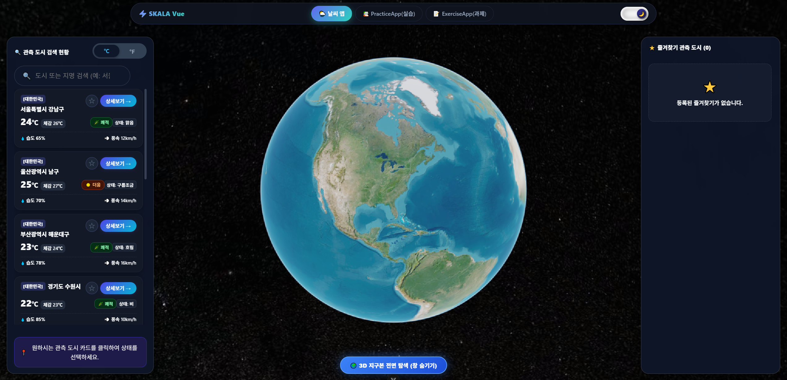
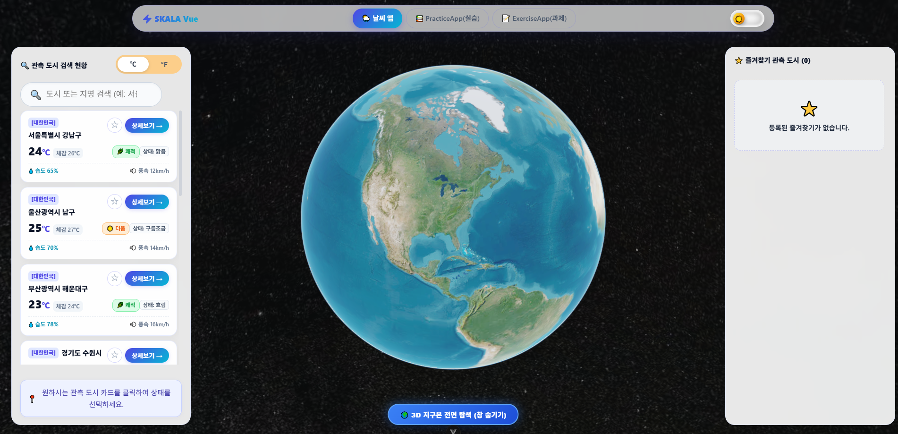
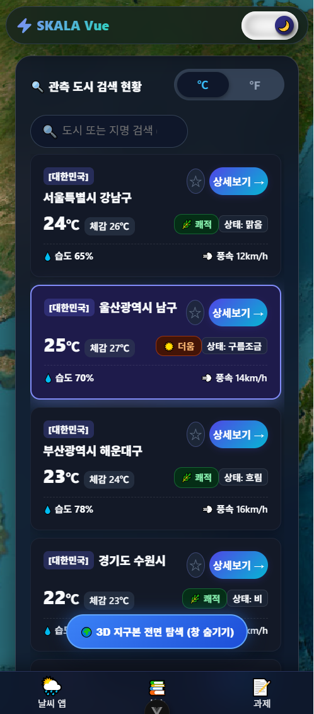
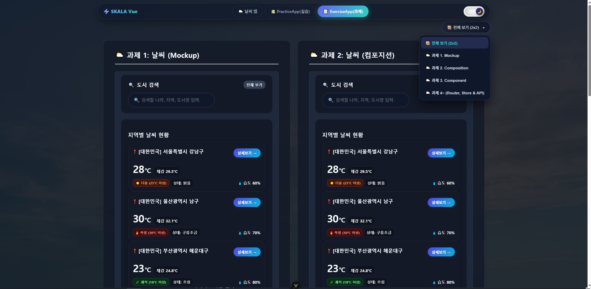
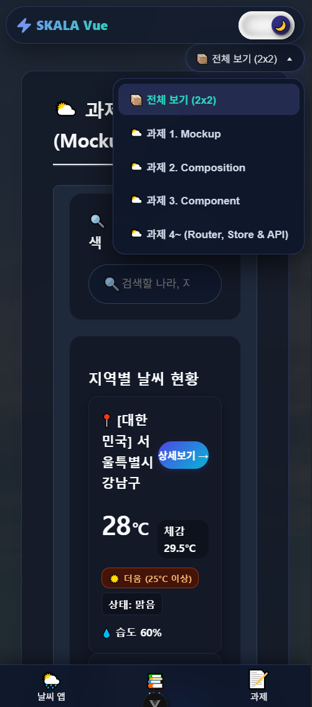
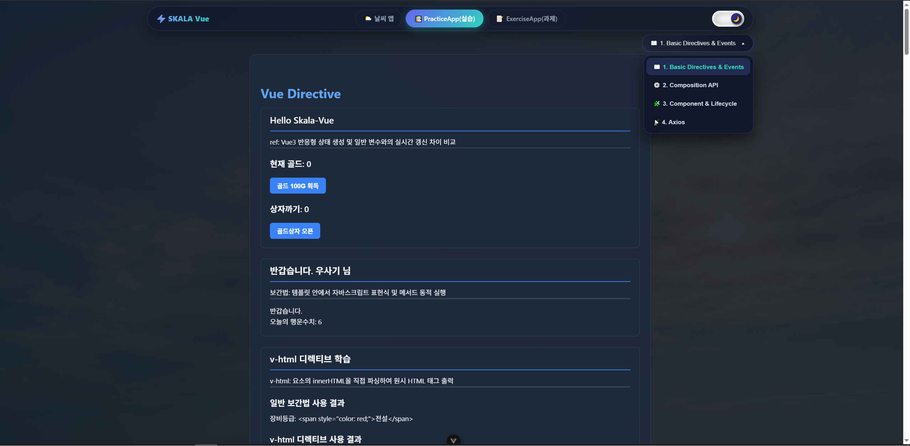
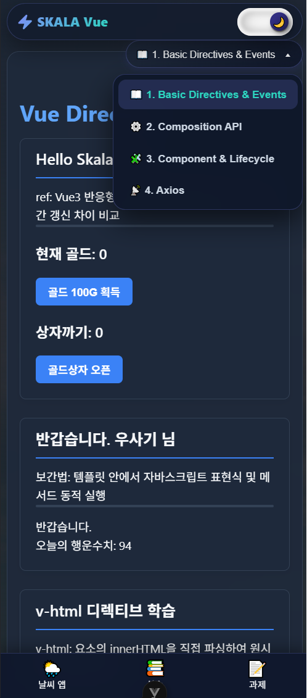

# 🌍 SKALA Vue.js 실시간 기상 관측 대시보드 SPA

> **SK Inc. AX Vue.js 종합실습 과정 (Day 1 ~ Day 4, 과제 ① ~ 과제 ⑨) 전 과정 완수 프로젝트**  
> OpenWeatherMap & WeatherAPI 연동 · CesiumJS 3D 실사 위성 지구본 · Pinia 10분 TTL 타임스탬프 캐싱 · 글래스모피즘 RWD

[](https://skala-vue-phi-seven.vercel.app/)
[](https://skala.weon.kro.kr/)
[](https://vuejs.org/)
[](https://vitejs.dev/)

---

## 🌐 라이브 배포 주소 및 실서버 상태 (Live Deployment & Status)

|     호스팅 구분     | 배포 주소 (Live URL)                                                              |                                                                실시간 서버 상태 (Status)                                                                | 비고                  |
| :-----------------: | --------------------------------------------------------------------------------- | :------------------------------------------------------------------------------------------------------------------------------------------------------: | --------------------- |
|  **Vercel**  | [https://skala-vue-phi-seven.vercel.app/](https://skala-vue-phi-seven.vercel.app/) |  | Vercel 호스팅         |
| **개인 서버** | [https://skala.weon.kro.kr/](https://skala.weon.kro.kr/)                           |                | Nginx 개인서버 호스팅 |

> 💡 **접속 안내**: 시크릿 창(`Cmd + Shift + N` / `Ctrl + Shift + N`) 접속 시 별도 로그인 없이 소스코드가 정상 작동합니다.

---

## 📸 주요 시스템 실행 화면 (System Showcase)

### 1. 🌌 메인 날씨 대시보드 & 3D 실사 위성 지구본 (Main App)

<p align="center">
  
  
</p>

* **[좌] PC 데스크톱 다크 모드 (`home_dark.png`)**: 오로라 미드나잇 테마의 CesiumJS 3D 실사 위성 지구본, 관측 도시 실시간 기온(°C) 캔버스 렌더링, 1000px 대형 검색바 및 글래스모피즘 카드 레이아웃.
* **[우] PC 데스크톱 라이트 모드 (`home_light.png`)**: 맑음 테마의 화사한 라이트 모드로 Open-Meteo API 연동 10개 도시 실시간 기상 상태 및 섭씨/화씨 전역 토글러가 동기화된 화면.

<p align="center">
  
  
</p>

* **[좌] PC 3D 위성 지형 Zoom-In (`zoom_in.png`)**: 도시 선택 시 `flyTo` 카메라 비행으로 초고해상도 위성 지형에 접근하며 24시간/7일 실시간 일기예보 글래스모피즘 모달이 활성화된 화면.
* **[우] 메인 앱 모바일 반응형 뷰 (`home_mobile.png`)**: 모바일 해상도(375px~768px) 반응형 1컬럼 스택 레이아웃 및 iOS/Android 하단 주소창 겹침 방지 Safe Area 보정 화면.

---

### 2. ⛅ 과제 대시보드 (ExerciseApp - 과제 1~5)

<p align="center">
  
  
</p>

* **[좌] 과제 PC 데스크톱 2x2 그리드 뷰 (`exercise.png`)**: 과제 ①(Mockup), 과제 ②(Composition API 검색), 과제 ③(컴포넌트 4종 분리), 과제 ④/⑤(Vue Router & Pinia 스토어)를 한눈에 비교·테스트하는 대시보드 화면.
* **[우] 과제 모바일 반응형 뷰 (`home_exercise.png`)**: 모바일 디바이스 화면에 맞춰 1열 세로 스택으로 자동 재배치되는 모바일 반응형 과제 뷰 화면.

---

### 3. 📚 실습 대시보드 (PracticeApp - 실습 46종)

<p align="center">
  
  
</p>

* **[좌] 실습 PC 데스크톱 뷰 (`practice.png`)**: Basic 23종, Component 10종, Composition 8종, Library 5종의 Vue 3 핵심 실습 예제를 모듈화하여 한곳에서 구동하는 PC 화면.
* **[우] 실습 모바일 반응형 뷰 (`home_pratice.png`)**: 모바일 해상도에서도 터치 및 탭 스위칭이 용이하도록 가변 1컬럼 레이아웃으로 최적화된 모바일 실습 화면.

---

## 🔑 1. 환경 변수 보안 설정 (.env.local) — 과제 ⑧

과제 ⑧ 요구사항에 따라 외부 API Key는 코드에 하드코딩하지 않고 `.env.local` 파일로 추출 관리합니다.

프로젝트 루트 경로에 `.env.local` 파일을 생성하고 아래 키를 설정하세요:

```env
# OpenWeatherMap 32자리 API Key (과제 ⑥ 연동용)
VITE_OPEN_WEATHER_API=YOUR_32_DIGIT_OPENWEATHERMAP_API_KEY

# WeatherAPI Key (메인 앱 3D 지구본 연동용)
VITE_WEATHER_API_KEY=YOUR_WEATHERAPI_KEY
```

> ⚠️ **보안 원칙**: `.gitignore` 파일에 `.env.local` 및 `.env.*`, `node_modules`가 추가되어 깃허브 원격 저장소 커밋이 자동 차단됩니다.

---

## 🚀 2. 빌드 및 배포 방법 (Build & Deployment) — 과제 ⑨

### ⚙️ Vite Base 경로 설정 (`vite.config.js`)

GitHub Pages 등 정적 호스팅 환경에 맞춰 `vite.config.js`에 `base` 옵션을 지정합니다:

```javascript
import { fileURLToPath, URL } from node:url
import { defineConfig } from vite
import vue from @vitejs/plugin-vue
import Components from unplugin-vue-components/vite

export default defineConfig({
  base: process.env.NODE_ENV === production ? /skala-vue/ : /,
  plugins: [
    vue(),
    Components({
      dirs: [src/components],
      extensions: [vue],
    }),
  ],
  resolve: {
    alias: {
      @: fileURLToPath(new URL(./src, import.meta.url)),
    },
  },
})
```

### 📦 실행 스크립트 및 gh-pages 배포

```bash
# 1. 의존성 패키지 설치
npm install

# 2. 개발 서버 실행
npm run dev

# 3. ESLint 코드 품질 검사 (0 Error / 0 Warning)
npx eslint src/ --ext .js,.vue

# 4. 프로덕션 정적 빌드
npm run build

# 5. GitHub Pages 배포 (gh-pages 연동 시)
npm run deploy
```

---

## 📌 과제 요구사항 준수 현황 (Requirements Checklist)

|       과제       | 주제 및 핵심 기능                                                                                | 구현 위치                                          |      준수 상태      |
| :---------------: | ------------------------------------------------------------------------------------------------ | -------------------------------------------------- | :-----------------: |
| **과제 ①** | 날씨 대시보드 Mockup (`v-for`, `v-if/v-else`, IME 차단, `.stop` 버블링 방지)               | `src/components/exercise/WeatherMockup.vue`      | **100% PASS** |
| **과제 ②** | Composition API 실시간 검색 (`ref`, `computed`, `watch/watchEffect`, 예외 분기)            | `src/components/exercise/WeatherComposition.vue` | **100% PASS** |
| **과제 ③** | 컴포넌트 4종 분리 (`WeatherParent`, `BaseDashboardCard`, `SearchBar`, `WeatherCard`)     | `src/components/exercise/` 하위 컴포넌트         | **100% PASS** |
| **과제 ④** | Vue Router 주소 이동 (Lazy Loading,`RouterLink/View`, `?search=` 복원, Catch-all 404)        | `src/router/index.js`, `src/views/weather/`    | **100% PASS** |
| **과제 ⑤** | Pinia 섭씨/화씨 전역 관리 (`configStore`, `UnitToggler`, 화씨 환산 수식, 25°C 고수)         | `src/stores/configStore.js`, `UnitToggler.vue` | **100% PASS** |
| **과제 ⑥** | Axios 외부 날씨 API 연동 (`Promise.all`, `cityMapping`, `try-catch-finally`, `&lang=kr`) | `src/stores/exerciseWeatherStore.js`             | **100% PASS** |
| **과제 ⑦** | Lint/Format 코드 정제 (ESLint 정적 검사 오류 0건 통과)                                           | 프로젝트 전반 (`npm run lint`)                   | **100% PASS** |
| **과제 ⑧** | API Key 보안 분리 (`import.meta.env`, `.gitignore` 연계)                                     | `exerciseWeatherStore.js`, `.gitignore`        | **100% PASS** |
| **과제 ⑨** | 정적 빌드 및 배포 (`vite.config.js` base, `gh-pages` deploy / 호스팅 배포)                   | `README.md` 섹션 2 참고                          | **100% PASS** |

> 📋 상세 세부 요구사항 검증표는 [**`docs/REQUIREMENTS_CHECKLIST.md`**](docs/REQUIREMENTS_CHECKLIST.md)에서 확인하실 수 있습니다.

---

## 📂 상세 문서 목차 (Documentation Index)

1. 📋 [**과제 ① ~ ⑨ 요구사항 이행 검증 보고서**](docs/REQUIREMENTS_CHECKLIST.md)
   - 각 과제별 뷰 디렉티브, Composition API, 컴포넌트 분리, 라우터, Pinia, Axios 스펙 검증
2. 🎨 [**독창적 UI/UX & 기술 고도화 (Customizations)**](docs/CUSTOMIZATIONS.md)
   - CesiumJS 3D 실사 위성 지구본, Canvas 온도 아이콘, Glassmorphism, 10분 TTL 캐싱, IME 정규식 예외 처리
3. 📝 [**ExerciseApp (과제 1~3 스냅샷 & 과제 4~ 통합 SPA) 교재 기반 상세 보고서**](docs/EXERCISE.md)
   - 교재 요구사항 대비 소스 코드 및 구조 세부 분석
4. 📚 [**PracticeApp (실습 46종) 종합 보고서**](docs/PRACTICE.md)
   - Basic(23종), Component(10종), Composition(8종), Library(5종) 실습 구현 내역

---

## 🛠️ 주요 핵심 커스터마이징 하이라이트 (Core Highlights)

1. **🌍 CesiumJS 기반 3D 실사 위성 지구본 뷰어 (`Main3DGlobeBackground.vue`)**
   - ArcGIS HD 실사 위성 지도 타일 맵 탑재.
   - 핀 아이콘 대신 관측 도시의 **실시간 기온(°C)**을 캔버스 아이콘으로 렌더링.
   - 도시 클릭/검색 시 3D 카메라 비행 (`flyTo`) 및 3초 유휴 시 자연스러운 자전 회전.
2. **💎 Glassmorphism UI & 전역 3D 다크모드**
   - `backdrop-filter: blur(16px)`와 반투명 글래스 카드로 3D 지구본이 입체적으로 투영되는 고급 UI/UX.
3. **⚡ Pinia 클라이언트 10분 TTL 타임스탬프 캐싱 (`exerciseWeatherStore.js`)**
   - 수신 시각(`fetchedAt`) 기준 10분(600초) 이내 재방문 시 API 호출 100% 스킵.
4. **📱 모바일 반응형 (RWD) & Safe Area 보정**
   - iOS/Android 하단 주소창 및 홈 인디케이터 바 간섭을 `env(safe-area-inset-bottom)`으로 보정.
